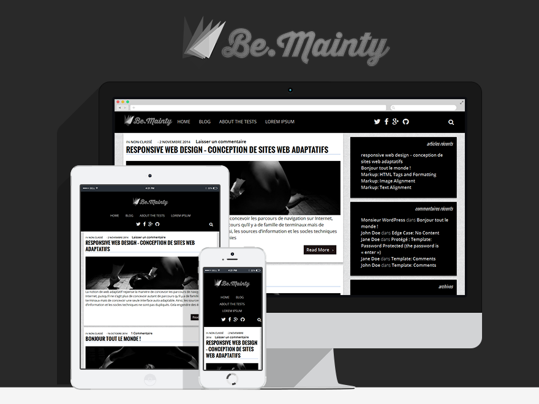

Bemainty: 0.8.1
========

ENG
---
Bemainty is a monochrome responsive theme, black and white, with your logo in the title box. The design is based on minimalism and simplicity. A special care is taken to the typography for a better reading and for the comfort of readers.
Bemainty can be adapted to any form of screen. It offers a secondary menu, specially developed for social media. To connect with your profiles, go to menu, choose Social Media, add links to your profiles and save.

Bemainty is a Malagasy word that means "the great black", hence the monochrome inspiration.
It's distributed on licence GNU/GPL, so don't hesitate to share, to edit or to make it known.
Goodbye, peace and healing on thine.

FR
---

Bemainty est un thème responsive monochrome en noir et blanc, avec votre logo à la place du titre. La conception est basée sur la simplicité et le minimalisme. Un soin particulier est apporté à la typographie, pour que les lecteurs puissent avoir le meilleur confort de lecture possible. Bemainty peut s'adapter à toutes formes d'écrans. Il propose également un deuxième menu spécialement élaborer pour les réseaux sociaux. Pour le connecter à vos profiles sur les réseaux sociaux. Allez dans menu, choisissez Social Media, ajoutez les liens vers vos profils sociaux, et enregistrez le menu.

Bemainty est mot d'origine malgache qui veut dire "le grand noir" d'où l'inspiration monochrome. Il est distribué en licence GNU/GPL alors n'hésitez pas à le partager, à le modifier ou à le faire connaitre.
Salut, Paix et guérison sur les tiens.

License: GNU General Public License v2 or later
License URI: http://www.gnu.org/licenses/gpl-2.0.html
